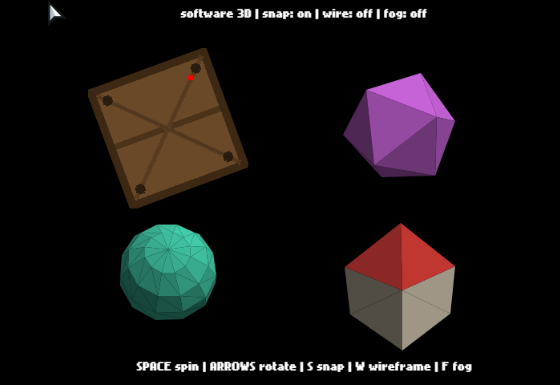
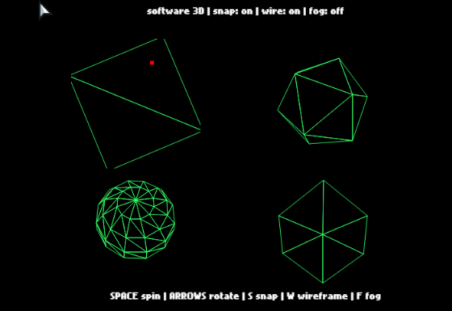
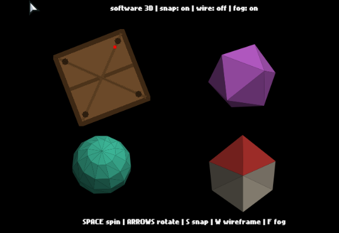

# Flx3DDemo

Software-rendered 3D models in [HaxeFlixel](https://haxeflixel.com/). A `ModelSprite` is a regular FlxSprite whose pixels are a 3D viewport: it loads an OBJ model, rotates and projects it in perspective, and rasterizes it every frame. Written entirely in Haxe with no OpenGL code and no native libraries, so it works the same on every target.

The renderer intentionally reproduces the look of early 3D consoles: affine texture mapping (textures wobble slightly as surfaces turn), integer vertex snapping, and nearest-neighbor sampling. It is meant for low-poly props, pickups, and backgrounds inside a 2D game, not for building a full 3D game.



## Usage

```haxe
var cube = new ModelSprite(40, 120, 260, 260, "assets/models/cube.obj", Assets.getBitmapData("assets/images/crate.png"));
cube.spinX = 0.4;
add(cube);
```

The last two constructor arguments are the model path and an optional texture. Without a texture, faces are flat-shaded with a directional light using `baseColor` and `ambient`.

A model that fails to load shows a magenta placeholder and logs a warning.

### Properties

- `rotX` / `rotY` / `rotZ` — current rotation in radians
- `spinX` / `spinY` / `spinZ` — automatic rotation speed in radians per second
- `modelScale` — model size within the viewport
- `pivotX` / `pivotY` / `pivotZ` — rotation pivot in model space (default center; set `pivotY = -1` to rotate around the model's base)
- `focal`, `camDistance` — perspective strength and camera distance
- `camYaw`, `camPitch`, `zoom` — orbit and zoom the camera instead of rotating the model
- `vertexSnap` — toggle integer vertex snapping
- `baseColor`, `ambient` — flat-shading color and minimum brightness (untextured models)
- `textureShading` — strength of directional shading on textured models (0 disables)
- `fogEnabled`, `fogColor`, `fogNear`, `fogFar` — distance fog; faces fade toward the fog color with depth
- `wireframe`, `wireColor`, `wireThickness` — draw edges instead of filled faces

| Wireframe | Fog |
| --- | --- |
|  |  |

`worldToScreen(x, y, z)` returns the viewport position of a model-space point, for pinning 2D sprites (labels, particles) to a spot on the model.

### Primitives

`Primitives.cube()`, `plane()`, `sphere(latSegments, lonSegments)`, and `cylinder(segments)` generate models in code — no OBJ files needed. Assign one with `sprite.setModel(...)`.

Parsed models are cached and shared: loading the same OBJ in several sprites parses it once. `ModelCache.clear()` frees the cache, and `ModelCache.enableAutoClear()` clears automatically on every state switch; sprites that survive a switch reload their model on the next update.

Rendering only happens when something changed — a sprite that is not rotating costs almost nothing per frame.

## Model format

Wavefront OBJ: `v`, `vt`, `f`, and `usemtl` records. Quads and n-gons are triangulated on load, and models are normalized to a standard size, so exports from Blender or elsewhere work without manual scaling. Faces must use the standard counter-clockwise winding.

If the OBJ references an `.mtl` file (`mtllib`), diffuse colors (`Kd`) are applied per face on untextured models, so a Blender export with colored materials renders with those colors.

OBJ files must be packaged as text. Keep them in a dedicated folder declared like this in `Project.xml`:

```xml
<assets path="assets" exclude="models" />
<assets path="assets/models" rename="assets/models" type="text" />
```

## Limitations

- One texture per model; no glTF, no texture references in MTL files (diffuse colors only)
- Depth is handled by sorting faces (painter's algorithm), not a depth buffer. Intersecting or strongly concave geometry can draw in the wrong order. Convex, low-poly models render correctly.
- No near-plane clipping: geometry that gets too close to the camera disappears per-face rather than being sliced
- Untextured rendering issues one fill per face, which is fine for low-poly models and slow past a few thousand triangles

## Demo

```
lime test html5
```

The demo shows four models: a crate-textured cube (with a marker sprite pinned to one corner via `worldToScreen`), a flat-shaded icosahedron, a generated sphere primitive, and a house colored by its MTL materials. SPACE toggles spinning, arrow keys rotate, S toggles vertex snapping, W toggles wireframe, F toggles fog.
